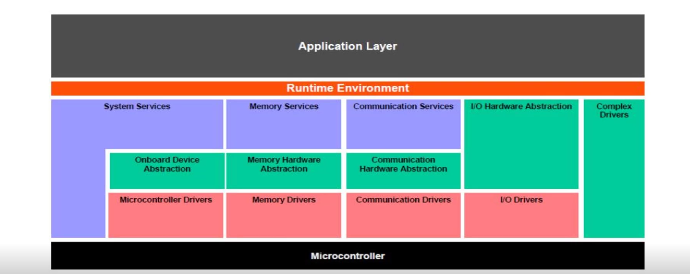
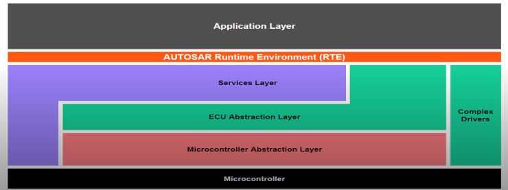
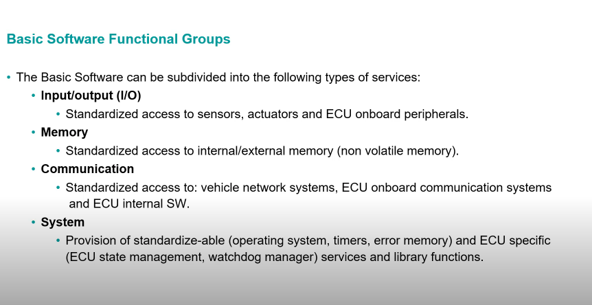
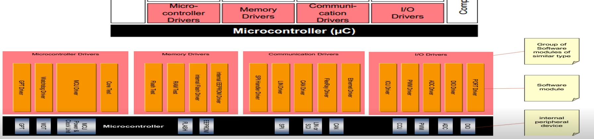
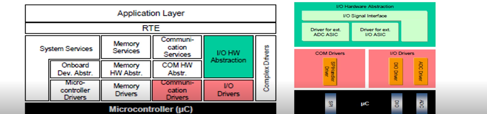
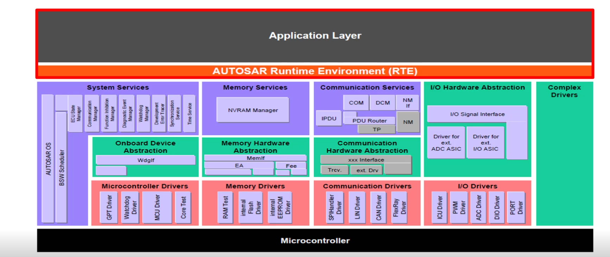
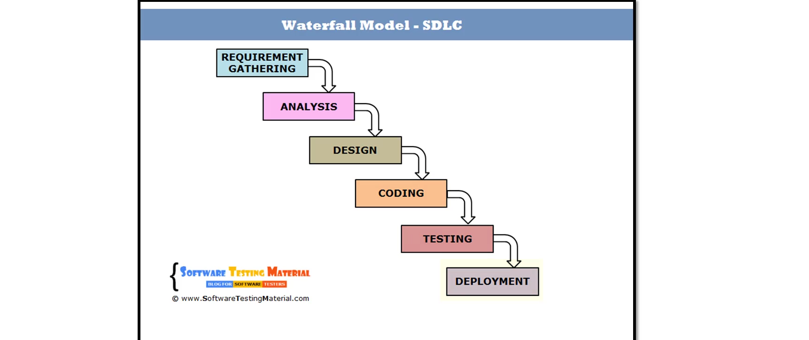
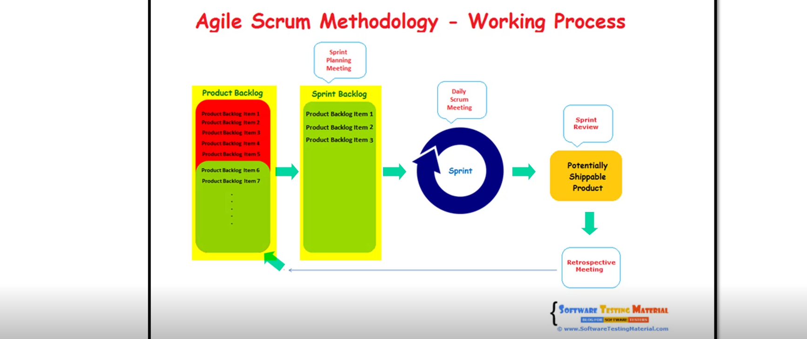
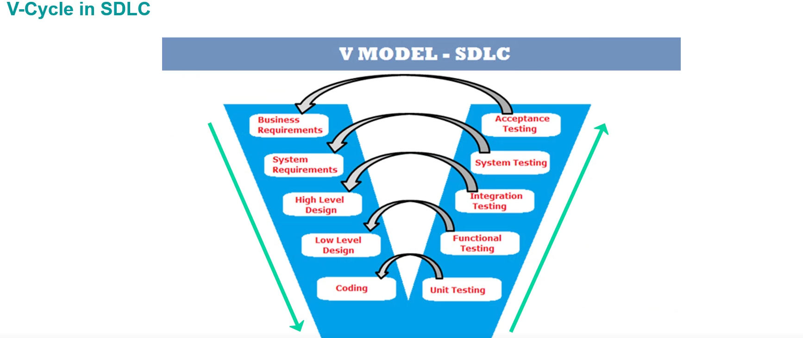

Automotive Open System Architecture

Goal : develop refrence arch for auto ECU software

WHy? Modulatrity , scalability, reusability

objective : improve software qualitt , reduce cost

AUTOSAR SW layers : APP LAYER ,RTE,BSW

BSW: Service , EAL,MAL,COmplex drivers

BSW:are divided to stacks like memory stack , com stack,system stack:OS,error ,states

## MCAL

lowest sw layers : contains internal drivers with direct acess to the microcontroller , internal peripherals

Com drivers , IO drivers , Memory Drivers,Microcontroller driver

## HAL

Drivers for external devices

